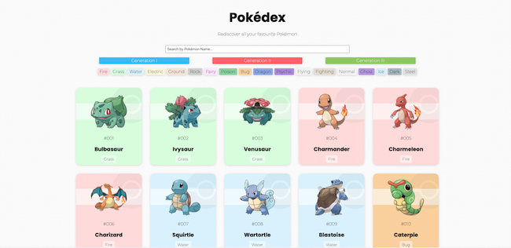

# Poke API

  <kbd>
    
  </kbd>

## Description

A React application made to display data fetched from the Poke API. Users have the ability to search for Pokemon by type or search for a Pokemon's name in the search bar. Users are also able to switch between the first three generations of Pokemon and click on each individual to reveal more data about each one.

My aim with building this project was to better my understanding of React and how to effectively use reusable components. I wanted to learn how to use Material UI with React and I was looking to broaden my knowledge of using a nested API to dynamically display data.

### Built with

- React
- HTML
- CSS

### Installation

npm install

### Legal disclaimer

Usage of this tool for attacking targets without prior mutual consent is illegal. It is the end user's responsibility to obey all applicable local, state, and federal laws. Developers assume no liability and are not responsible for any misuse or damage caused by this program.

### License

This project is licensed under the [MIT License](LICENSE.md).
